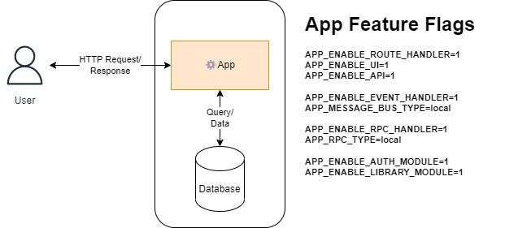
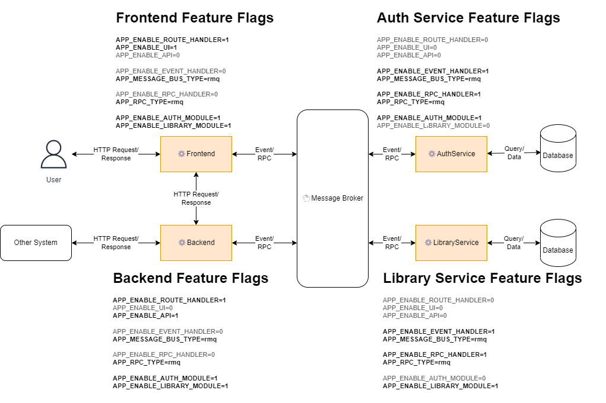
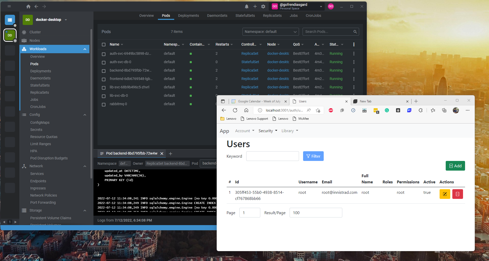

# Amalgam

A case study of creating a microservices-ready/modular monolith.

In this repo, you can see:

- how to generate microservices-ready monolith
- how to run your application as a monolith
- how to split and run the same application as microservices
- how to deploy to Kubernetes (using docker-desktop)

Please see [init.sh](init.sh) for more details.

# What is a microservices-ready monolith?

Microservices-ready monolith is a monolith application that can be split and deployed as microservices.

We can create a microservices-ready monolith by using:

- Feature flags
- Interface and layered architecture

Please visit [myApp documentation](myProject/myApp/_docs/README.md) for more information.

Microservices-ready monolith has all the advantages of a monolith app. One of those advantages is simplicity.

When done correctly, you can split the monolith into independent microservices. You can even rewrite some modules with different technologies/programming languages.

# How to generate everything

```bash
./init.sh
```

More than 90% of this repository was generated by using Zaruba.

You can run [init.sh](init.sh) to re-generate everything.

Having your application generated gives you some advantages:

- You can work more quickly.
- You don't need to write everything from scratch.
    - You are encouraged to follow the structure/architecture.
    - You are encouraged to write unit tests.
- Less human error.

Please visit [myApp documentation](myProject/myApp/_docs/README.md) for more information.

# How to run your application as a monolith

```bash
cd myProject
zaruba please startMyApp

# (or run as container)
# zaruba pleaase startMyAppContainer
# (ctrl + c)
# zaruba please stopContainers
```



# How to run your application as a microservices

```bash
cd myProject
zaruba please startMyMicroservices

# (or run as containers)
# zaruba please startMyMicroservicesContainer
# (ctrl + c)
# zaruba please stopContainers
```




# How to deploy to Kubernetes

```bash
cd myProject
zaruba please deploy
# zaruba please destroy
```



