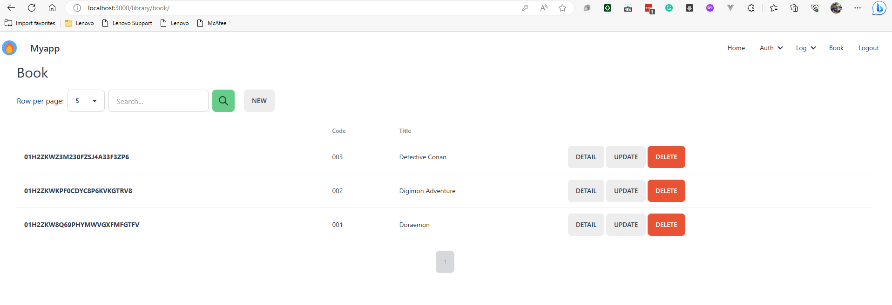

# Amalgam

In this demo, you will see how you can use [Zrb](https://pypi.org/project/zrb) to:

- Create a modular-monolith CRUD application.
- Add some entities/fields.
- Run the application as monolith/microservices.

No coding skill is required.

# Start the demo

Before starting the demo, you need to make sure you have the following software installed:

- Python (3.10 or higher)
- Pip
- Venv
- Zrb

Once everything is set, you can run the following script on your terminal:

```bash
./init.sh
```

The commands will give you:

- A folder named `my-project`.
- A Python application under the project (`my-project/src/myapp`).
- A `library` module under the application (`myproject/src/myapp/src/module/library`)
- A `book` entity under the `library` module.
- A field named `title` under the `book` entity.

It will also run the application on your local computer.

# Open myapp from the browser

You can visit [http://localhost:3000](http://localhost:3000) to see how the application works.

The default username and password will be `root` and `toor`.

Try to add some books.



# Override default username and password

You can override the system username and password by setting some environment variables:

```bash
# press ctrl + c to stop the application
export MYAPP_APP_AUTH_ADMIN_USERNAME=gofrendi
export MYAPP_APP_AUTH_ADMIN_PASSWORD=aVeryStrongPassword73
zrb project myapp monolith start 
```

# Checking the process

Currently, `myapp` is running as a single process on your local computer.

Let's confirm this by opening a new terminal and invoking the following command:

```bash
pgrep uvicorn -a
```

You should see a single process like this:

```
4001 ... main:app --host 0.0.0.0 --port 3000 --reload --reload-include index.html
```

# Run Myapp as Microservices

Now let's go back to your first terminal; so that you can kill `my-app` process by pressing `ctrl + c`.

Stay in your first terminal, and try to invoke the following command:

```bash
zrb project myapp microservices start
```

Once started, you will be able to access [http://localhost:3000](http://localhost:3000) as you have done previously.

Now let's invoke the following command on your second terminal:

```bash
pgrep uvicorn -a
```

```
5305 ... main:app --host 0.0.0.0 --port 3000 --reload --reload-include index.html
5307 ... main:app --host 0.0.0.0 --port 3001 --reload --reload-include index.html
5309 ... main:app --host 0.0.0.0 --port 3002 --reload --reload-include index.html
5311 ... main:app --host 0.0.0.0 --port 3003 --reload --reload-include index.html
```

You can see that now you have multiple processes.

Each process handles different aspect of the application:

- `myapp-gateway` (port: 3000)
    - Handle HTTP requests from user
    - Send RPC requests to other services
    - Consume RPC replies from other services
- `myapp-auth-service` (port: 3001)
    - Handle RPC requests related to authentication/authorization
    - Send RPC responses to Gateway
- `myapp-log-service` (port: 3002)
    - Handle RPC requests related to user activities/entities change history
    - Send RPC responses to Gateway
- `myapp-library-service` (port: 3002)
    - Handle RPC requests related to book management
    - Send RPC response to Gateway

You can see that you can run `myapp` as either microservices or as a Monolith.
